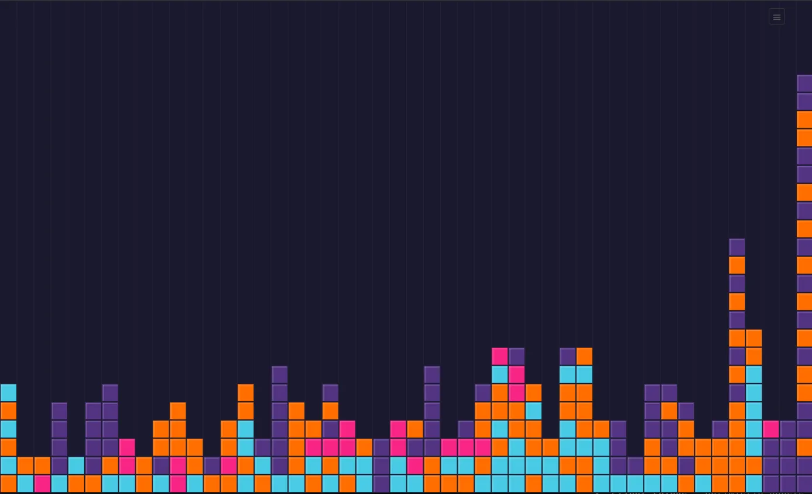

# 2x2 — Multiplayer Falling Squares



A real-time multiplayer game where players click to drop colored squares that fall with gravity and stack. Built as a demo of [SpacetimeDB](https://spacetimedb.com) — a database that doubles as a server.

**Live demo:** [2x2.dyatlov.net](https://2x2.dyatlov.net)

## What This Demos

Traditional multiplayer games need a game server that runs a tick loop, manages connections, serializes state, and broadcasts updates. SpacetimeDB replaces all of that. The database **is** the server:

- **Tables are the game state.** Each square is a row. Insert a row = place a square.
- **Reducers are the game logic.** The `placeSquare` reducer computes physics (landing positions and times) inside a database transaction.
- **Subscriptions are the networking.** Clients subscribe to the `square` table. When a row is inserted or updated, every client gets the change automatically.
- **Event tables are pub/sub.** Cursor positions use a transient event table — data is broadcast to subscribers and immediately deleted. No permanent storage for ephemeral data.

There is no game server. There is no WebSocket management code. There is no state synchronization layer. The database handles all of it.

## The Hard Problem: Concurrent Physics

The interesting complexity is what happens when multiple players drop squares simultaneously in the same column.

Imagine: Player A drops a square from the top. While it's falling, Player B drops a square near the bottom of the same column. Player B's square lands first (shorter fall), and Player A's square must now land **on top** of it — even though A's square was placed first.

The server resolves this with a **greedy slot assignment algorithm** that runs inside the `placeSquare` reducer:

1. For each landing slot (bottom to top), compute which in-flight square reaches it earliest using `t = t_start + √(2·distance/gravity)`
2. The earliest square claims that slot
3. All other squares in the column get recalculated — their landing positions shift up and their landing times change
4. Updated rows are broadcast to all clients, which adjust animations mid-flight

This runs in O(n²) where n is the number of in-flight squares in one column — typically 1–5. Each reducer call is a single atomic transaction, so concurrent drops are serialized by the database.

## Client Architecture

The client is intentionally simple — a full-screen HTML canvas with no framework:

- **Optimistic rendering:** Clicking spawns a semi-transparent "ghost" square immediately, before the server responds. When the real data arrives, the ghost is replaced. This eliminates perceived latency.
- **Clock calibration:** The client estimates the offset between its clock and the server's using timestamps from incoming events. This ensures consistent animation speed across devices.
- **Time-based interpolation:** Animation uses quadratic ease-in between server-provided start/end times, not pixel-based physics. Same visual speed on a phone and a 4K monitor.
- **Event table cursors:** Other players' cursor positions are broadcast via SpacetimeDB event tables (transient, fire-and-forget) and rendered as fading crosshairs with player names.

## Running Locally

```bash
# Install SpacetimeDB CLI
curl -sSf https://install.spacetimedb.com | sh

# Install dependencies
npm install

# Start SpacetimeDB, publish the module, generate bindings
spacetime start
spacetime publish --module-path spacetimedb --server local my-game --yes
spacetime generate --lang typescript --out-dir src/module_bindings --module-path spacetimedb

# Start the dev server
npm run dev
```

Open http://localhost:5173. Open a second tab to see multiplayer in action.

## Docker Deployment

```bash
docker compose up
```

This starts three services:
- **spacetimedb** — the database server (port 3000)
- **init** — publishes the game module, then exits
- **client** — nginx serving the built static files (port 80)

For production behind a reverse proxy (e.g., Caddy), the containers join an external `proxy` network with no host port mappings. See `docker-compose.yml`.

## Tech Stack

- **Server:** SpacetimeDB v2 with TypeScript module
- **Client:** Vanilla TypeScript + HTML Canvas, bundled by Vite
- **Deployment:** Docker Compose
